# ume

[简体中文](./README_cn.md)

[Community Version] UME is an in-app debug kits platform for Flutter apps.

[](https://pub.dev/packages/ume) [](https://github.com/bytedance/ume/blob/master/LICENSE)

[](https://pub.dev/packages/ume)
[](https://pub.dev/packages/ume)
[](https://pub.dev/packages/ume)
[](https://pub.dev/packages/ume)
[](https://pub.dev/packages/ume)

**Since `^1.0.0`, ume starts adapting to the Flutter 3. See [Quick Start] to learn more.**

Scan QR code or click link to download apk. Try it now!
https://github.com/bytedance/ume/releases/download/v0.2.1.0/app-debug.apk

There are 13 plugin kits built in the latest open source version of UME.
Developer could create custom plugin kits, and integrate them into UME.
Visit [Develop plugin kits for UME](#develop-plugin-kits-for-ume) for more details.

**Please see [Plugins from community](#plugins-from-community) to make your ume stronger.**

- [ume](#ume)
  - [Quick Start](#quick-start)
  - [IMPORTANT](#important)
  - [Features](#features)
  - [Develop plugin kits for UME](#develop-plugin-kits-for-ume)
    - [Access the nested widget debug kits quickly](#access-the-nested-widget-debug-kits-quickly)
  - [How to use UME in Release/Profile mode](#how-to-use-ume-in-releaseprofile-mode)
  - [About version](#about-version)
    - [Compatibility](#compatibility)
    - [Coverage](#coverage)
    - [Version upgrade rules](#version-upgrade-rules)
    - [Null-safety](#null-safety)
    - [Change log](#change-log)
  - [Contributing](#contributing)
    - [Contributors](#contributors)
    - [Plugins from community](#plugins-from-community)
    - [About the third-party open-source project dependencies](#about-the-third-party-open-source-project-dependencies)
  - [LICENSE](#license)
  - [Contact the author](#contact-the-author)

## Quick Start

**All packages whose names are prefixed with `ume_kit_` are function**
**plug-ins of UME, and users can access them according to demand**

1. Edit `pubspec.yaml`, and add dependencies.

   **Compatible with Flutter 3 since version `1.0.0`.**

   ```yaml
   dev_dependencies:
     ume: ^2.0.0
   ```

2. Run `flutter pub get`
3. Import packages

   ```dart
   import 'package:ume/ume.dart'; // UME framework
   ```

4. Edit main method of your app, register plugin kits and initial UME

   ```dart
   void main() {
     if (kDebugMode) {
       PluginManager.instance
        // Channel monitor
        ..register(ChannelMonitor())

        // Channel observer
        ..register(ChannelObserver())

        // Clean local data
        ..register(DataCleanPanel())

        // Console
        ..register(Console())

        // Database
        ..register(DatabasePanel(databases: []))

        // Designer check
        ..register(DesignerCheck())

        // Device
        ..register(CpuInfoPage())
        ..register(DeviceInfoPanel())

        // Dio
        ..register(DioInspector(dio: dio))

        // GetConnect
        ..register(GetConnectInspector(connect: get_connect))

        // Memory detector
        ..register(MemoryDetectorButton())

        // ..register(const DBViewer())

        // Monitor
        ..register(MonitorPlugin())
        ..register(const MonitorActionsPlugin())

        // Perf
        ..register(Performance())
        ..register(MemoryInfoPage())

        // SharedPreferences
        ..register(SharedPreferencesInspector())

        // Show code
        ..register(ShowCode())

        // Slow animation
        ..register(SlowAnimation())
        // UI inspector
        ..register(WidgetInfoInspector())
        ..register(WidgetDetailInspector())
        ..register(ColorSucker())
        ..register(AlignRuler())
        ..register(ColorPicker())
        ..register(TouchIndicator())

        // Custom router
        ..register(CustomRouterPluggable());

       runApp(UMEWidget(child: MyApp(), enable: true));
     } else {
       runApp(MyApp());
     }
   }
   ```

5. `flutter run` for running
   or `flutter build apk --debug`、`flutter build ios --debug` for building productions.

> Some functions rely on VM Service, and additional parameters need to be added for local operation to ensure that it can connect to the VM Service.
>
> Flutter 2.0.x, 2.2.x and other versions run on real devices, `flutter run` needs to add the `--disable-dds` parameter.
> After [Pull Request #80900](https://github.com/flutter/flutter/pull/80900) merging, `--disable-dds` was renamed to `--no-dds`.

## IMPORTANT

**From `0.1.1`/`0.2.1` version，we don't need set `useRootNavigator: false`.**
The following section only applies to versions before version `0.1.1`/`0.2.1` .

<s>

Since UME manages the routing stack at the top level, methods such as `showDialog` use `rootNavigator` to pop up by default,
therefore **must** pass in the parameter `useRootNavigator: false` in `showDialog`, `showGeneralDialog` and other 'show dialog' methods to avoid navigator errors.

```dart
showDialog(
  context: context,
  builder: (ctx) => AlertDialog(
        title: const Text('Dialog'),
        actions: <Widget>[
          TextButton(
              onPressed: () => Navigator.pop(context),
              child: const Text('OK'))
        ],
      ),
  useRootNavigator: false); // <===== It's very IMPORTANT!
```

</s>

## Features

There are 13 plugin kits built in the current open source version of UME.

<table border="1" width="100%">
    <tr>
        <td width="33.33%" align="center"><p>UI kits</p></td>
    </tr>
    <tr>
        <td width="33.33%" align="center">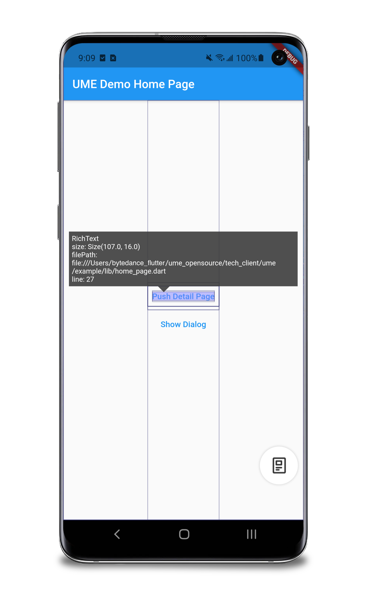</br>Widget Info</td>
        <td width="33.33%" align="center">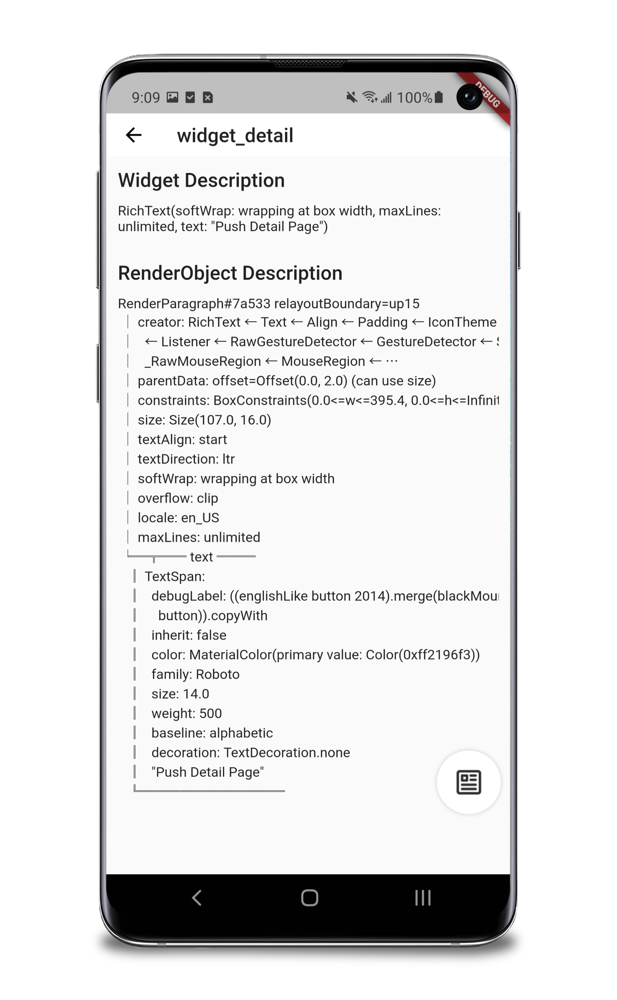</br>Widget Detail</td>
        <td width="33.33%" align="center">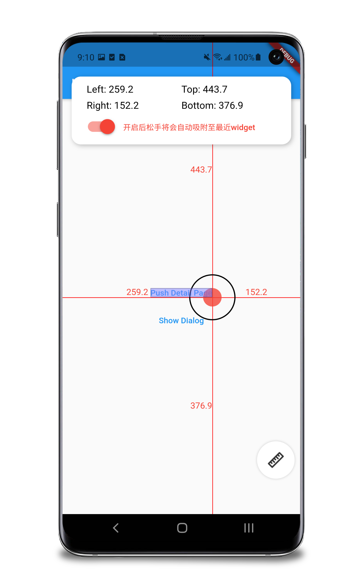</br>Align Ruler</td>
    </tr>
    <tr>
        <td width="33.33%" align="center">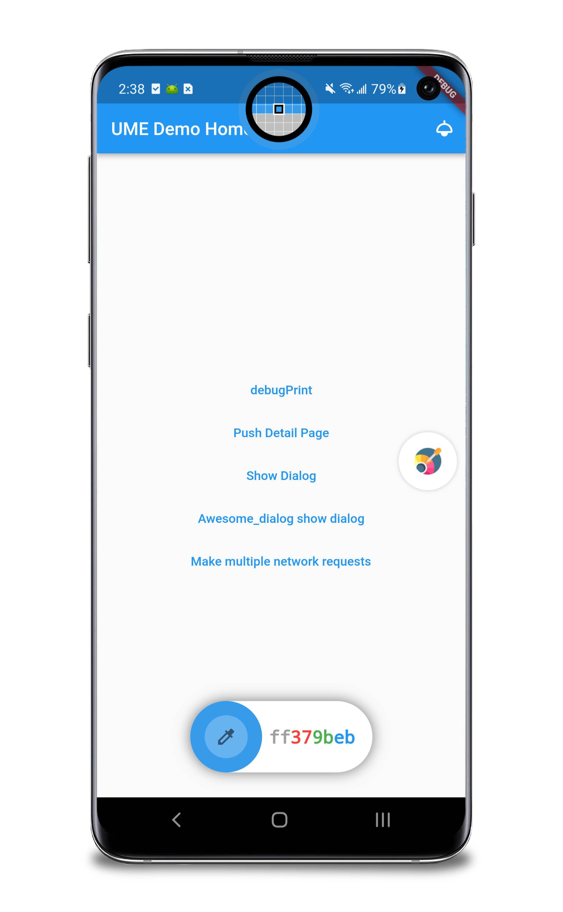</br>Color Picker</td>
        <td width="33.33%" align="center">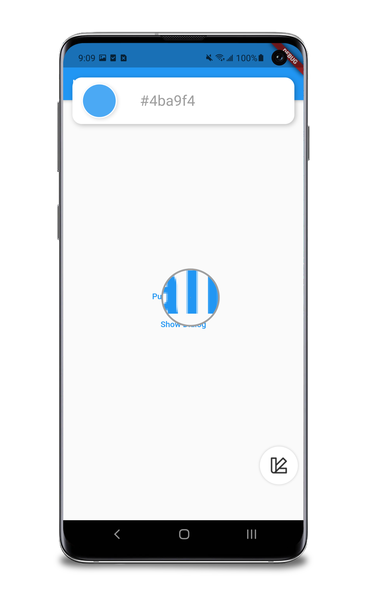</br>Color Sucker</td>
        <td width="33.33%" align="center">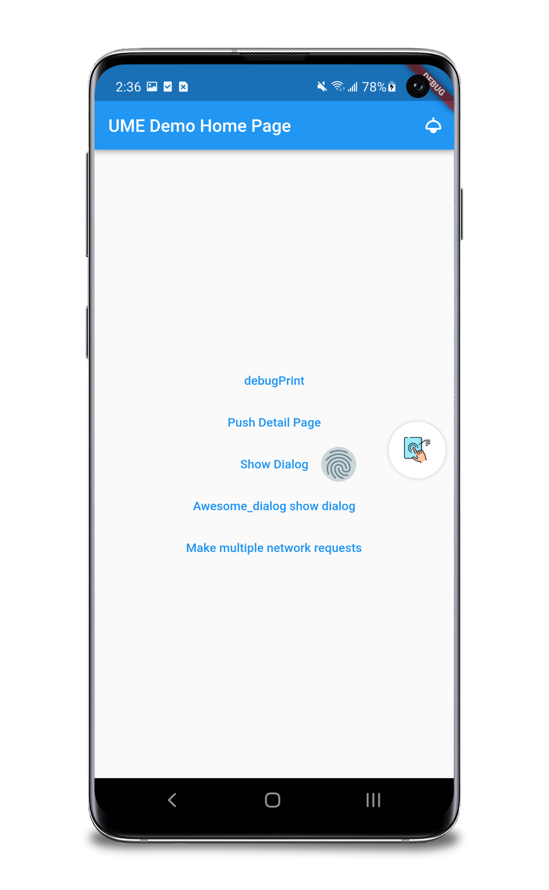</br>Touch Indicator</td>
    </tr>
    <tr>
        <td width="33.33%" align="center"></td>
    </tr>
    <tr>
        <td width="33.33%" align="center"><p>Performance Kits</p></td>
    </tr>
    <tr>
        <td width="33.33%" align="center">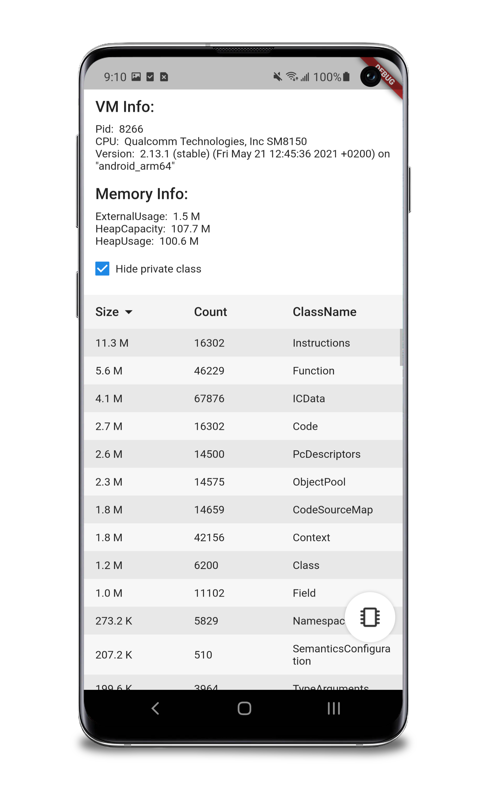</br>Memory Info</td>
        <td width="33.33%" align="center">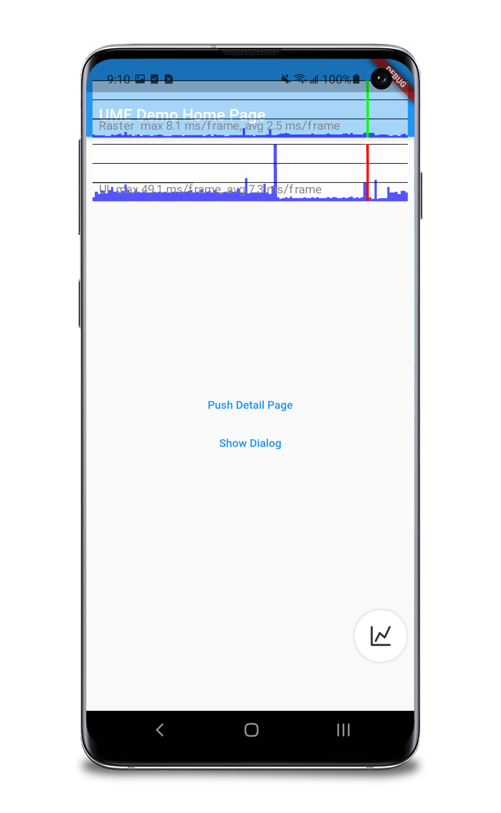</br>Perf Overlay</td>
    </tr>
    <tr>
        <td width="33.33%" align="center"></td>
    </tr>
    <tr>
        <td width="33.33%" align="center"><p>Device Info Kits</p></td>
    </tr>
    <tr>
        <td width="33.33%" align="center">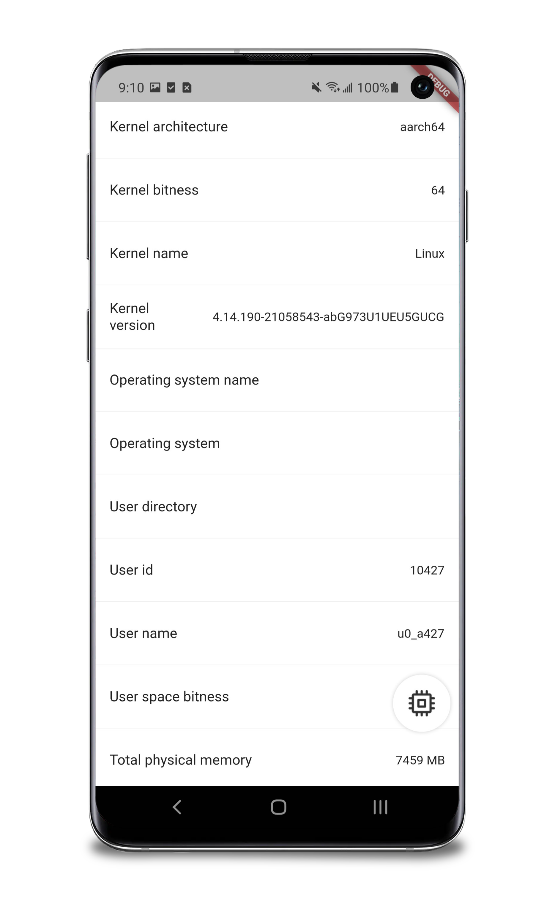</br>CPU Info</td>
        <td width="33.33%" align="center">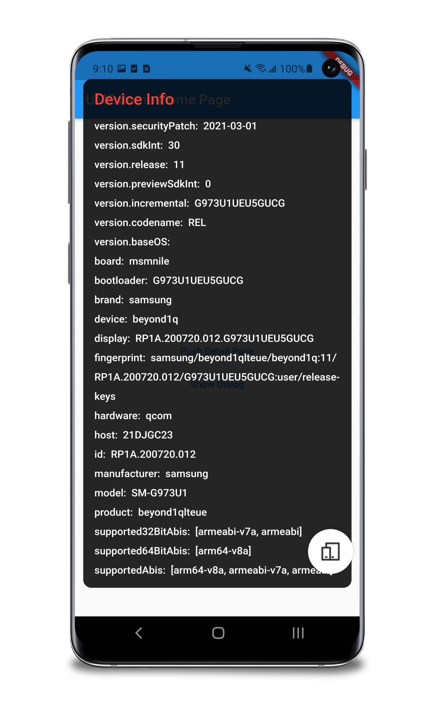</br>Device Info</td>
    </tr>
    <tr>
        <td width="33.33%" align="center"></td>
    </tr>
    <tr>
        <td width="33.33%" align="center"><p>Show Code</p></td>
    </tr>
    <tr>
        <td width="33.33%" align="center">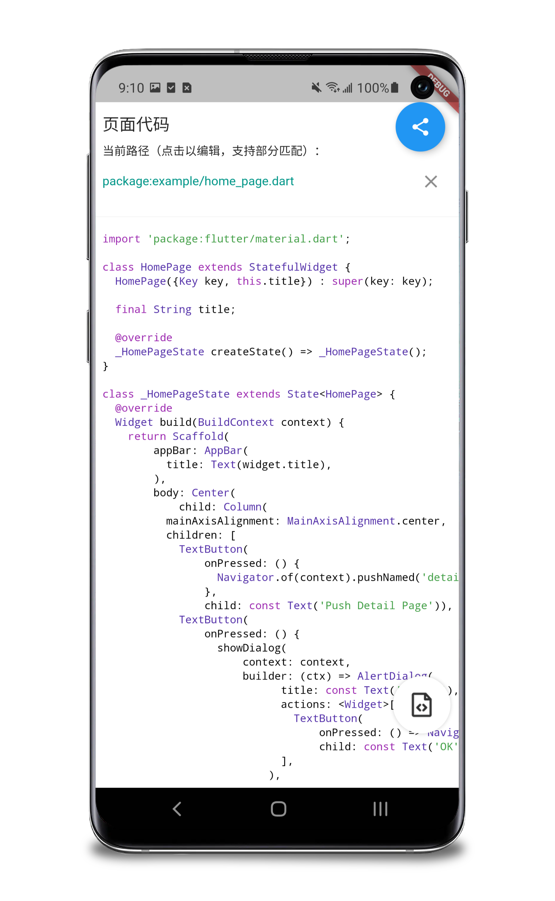</br>Show Code</td>
    </tr>
    <tr>
        <td width="33.33%" align="center"></td>
    </tr>
    <tr>
        <td width="33.33%" align="center"><p>Console</p></td>
    </tr>
    <tr>
        <td width="33.33%" align="center">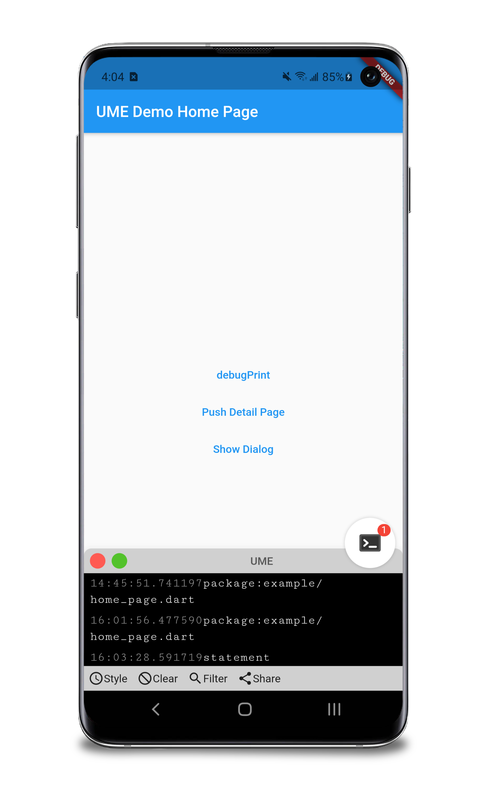</br>Console</td>
    </tr>
    <tr>
        <td width="33.33%" align="center"></td>
    </tr>
    <tr>
        <td width="33.33%" align="center"><p>Dio Inspector</p></td>
    </tr>
    <tr>
        <td width="33.33%" align="center">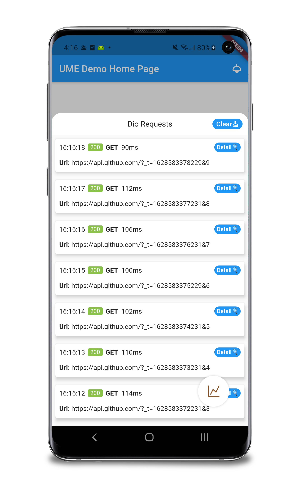</br>Dio Inspector</td>
    </tr>
</table>

## How to use UME in Release/Profile mode

**Once you use ume in Release/Profile mode, you agree that you will**
**bear the relevant risks by yourself.**

**The maintainer of ume does not assume any responsibility for the accident**
**caused by this.**

**We recommend not to use it in Release/Profile mode for the following reasons:**

1. VM Service is not available in these environments, so some functions are not available
2. In this environment, developers need to isolate the app distribution channels by themselves to avoid submitting relevant debugging code to the production environment

In order to use in Release/Profile mode, the details that need to be adjusted in the normal access process:

1. In `pubspec.yaml`, `ume` and plugins should be write below `dependencies` rather than `dev_dependencies`.
2. Don't put the code which call `PluginManager.instance.register()` and `UMEWidget(child: App())` into conditionals which represent debug mode. (Such as `kDebugMode`)
3. Ensure the above details, run `flutter clean` and `flutter pub get`, then build your app.

## About version

### Compatibility

| UME version | 1.12.13 | 1.22.3 | 2.0.1 | 2.2.3 | 2.5.3 | 2.8.0 | 3.0.5 | 3.3.1 |
| ----------- | ------- | ------ | ----- | ----- | ----- | ----- | ----- | ----- |
| 0.1.x       | ✅      | ✅     | ✅    | ✅    | ⚠️    | ⚠️    | ❌    | ❌    |
| 0.2.x       | ❌      | ❌     | ✅    | ✅    | ✅    | ⚠️    | ❌    | ❌    |
| 0.3.x       | ❌      | ❌     | ✅    | ✅    | ✅    | ✅    | ❌    | ❌    |
| 1.0.x       | ❌      | ❌     | ⚠️    | ⚠️    | ⚠️    | ⚠️    | ✅    | ✅    |
| 1.1.x       | ❌      | ❌     | ⚠️    | ⚠️    | ⚠️    | ⚠️    | ✅    | ✅    |

⚠️ means the version has not been fully tested for compatibility.

### Special case

- Please use `ume_kit_ui: ^1.1.0` and above version when you are using Flutter 3.7 and above.

### Coverage

| Package           | master                                                                                                        | develop                                                                                                        | develop_nullsafety                                                                                                        |
| ----------------- | ------------------------------------------------------------------------------------------------------------- | -------------------------------------------------------------------------------------------------------------- | ------------------------------------------------------------------------------------------------------------------------- |
| ume               |                         |                         |                         |
| ume_kit_device    |     |     |     |
| ume_kit_perf      |       |       |       |
| ume_kit_show_code |  |  |  |
| ume_kit_ui        |         |         |         |
| ume_kit_console   |    |    |    |
| ume_kit_dio       |        | N/A                                                                                                            |        |

### Version upgrade rules

Please refer to [Semantic versions](https://dart.dev/tools/pub/versioning#semantic-versions) for details.

### Change log

[Changelog](./CHANGELOG.md)

## Contributing

Contributing rules: [Contributing](./CONTRIBUTING_en.md)

### Contributors

Thanks to the following contributors (names not listed in order)：

|                                                                         |                                             |
| ----------------------------------------------------------------------- | ------------------------------------------- |
|   | [ShirelyC](https://github.com/smileShirely) |
|  | [lpylpyleo](https://github.com/lpylpyleo)   |
|    | [Alex Li](https://github.com/AlexV525)      |
|       | [Swain](https://github.com/talisk)          |
|  | [mengdouer](https://github.com/mengdouer)   |
|    | [LAIIIHZ](https://github.com/laiiihz)       |
|     | [XinLei](https://github.com/Vadaski)        |
|        | [suli](https://github.com/suli1)            |
|  | [wei-spring](https://github.com/wei-spring) |

### Plugins from community

- [ume_kit_channel_monitor](https://pub.dev/packages/ume_kit_channel_monitor)
  - Channel communication monitor
  - Cource code: https://github.com/bytedance/ume/tree/master/kits/ume_kit_channel_monitor
- [ume_kit_slow_animation](https://pub.dev/packages/ume_kit_slow_animation)
  - Animation speed control
  - Cource code: https://github.com/cfug/ume_kits
- [ume_kit_shared_preferences](https://pub.dev/packages/ume_kit_shared_preferences)
  - shared_preferences tool
  - Cource code: https://github.com/cfug/ume_kits
- [ume_kit_designer_check](https://pub.dev/packages/)
  - Comparing tool for Design UI and real UI
  - Cource code: https://github.com/cfug/ume_kits
- [ume_kit_clean_local_data](https://pub.dev/packages/ume_kit_clean_local_data)
  - Clean local data
  - Cource code: https://github.com/cfug/ume_kits 。
- [ume_kit_database_kit](https://pub.dev/packages/ume_kit_database_kit)
  - DB tool
  - Cource code: https://github.com/cfug/ume_kits 。
- [ume_kit_monitor](https://pub.dev/packages/ume_kit_monitor)
  - Parameters monitor tools
  - Cource code: https://github.com/fastcode555/ume_kit_monitor 。
- [json2dart_viewerffi](https://pub.dev/packages/json2dart_viewerffi)
  - DB tool
  - Cource code: https://github.com/fastcode555/Json2Dart_Null_Safety 。
- [json2dart_viewer](https://pub.dev/packages/json2dart_viewer)
  - DB tool
  - Cource code: https://github.com/fastcode555/Json2Dart_Null_Safety 。
- [ume_kit_memory_detector](https://github.com/bladeofgod/ume_kit_memory_detector)
  - Leaks tool
- [ume_kit_channel_observer](https://github.com/bladeofgod/ume_kit_channel_observer)
  - Channel communication monitor
- [flutter-ume-kit-dio-enhance](https://github.com/linversion/flutter-ume-kit-dio-enhance)
  - Plugin base on ume_kit_dio

### About the third-party open-source project dependencies

- The TouchIndicator use the pub [touch_indicator](https://pub.dev/packages/touch_indicator), the ColorPicker use the pub [cyclop](https://pub.dev/packages/cyclop).
- We [fork](https://github.com/talisk/cyclop) the package [cyclop](https://pub.dev/packages/cyclop) and modify some code meet our functional needs. We should depend cyclop by pub version after the [PR](https://github.com/rxlabz/cyclop/pull/11) being merged.

## LICENSE

This project is licensed under the MIT License - visit the [LICENSE](./LICENSE) for details.

## Contact the author

**Maybe...**

- Found a bug in the code, or an error in the documentation
- Produces an exception when you use the UME
- UME is not compatible with the new version Flutter
- Have a good idea or suggestion

You can [submit an issue](./CONTRIBUTING_en.md#how-to-raise-an-issue) in any of the above situations.

**Maybe...**

- Communicate with the author
- Communicate with more community developers
- Cooperate with UME

Welcome to [Join the ByteDance Flutter Exchange Group](https://applink.feishu.cn/client/chat/chatter/add_by_link?link_token=67au2f75-3783-41b0-8868-0fc0178f1fd8).

Or contact [author](mailto:sunkai.dev@bytedance.com).
