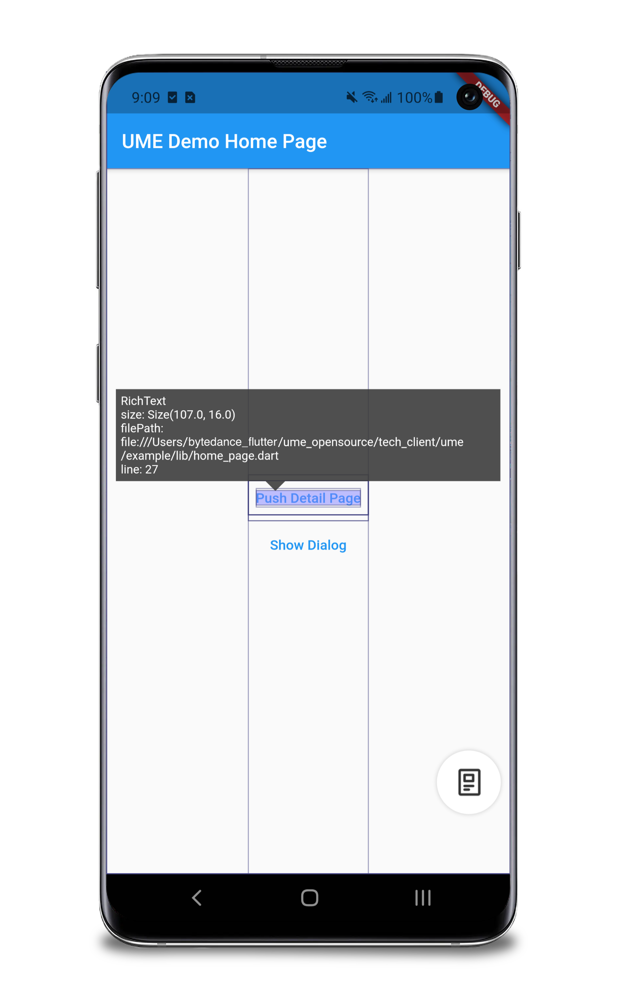
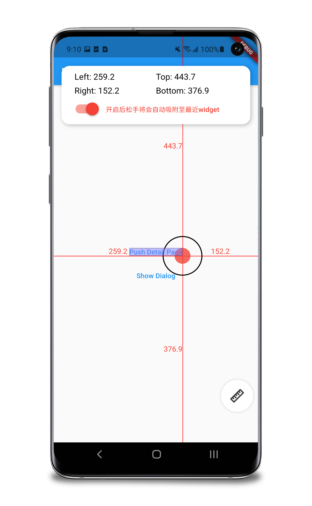
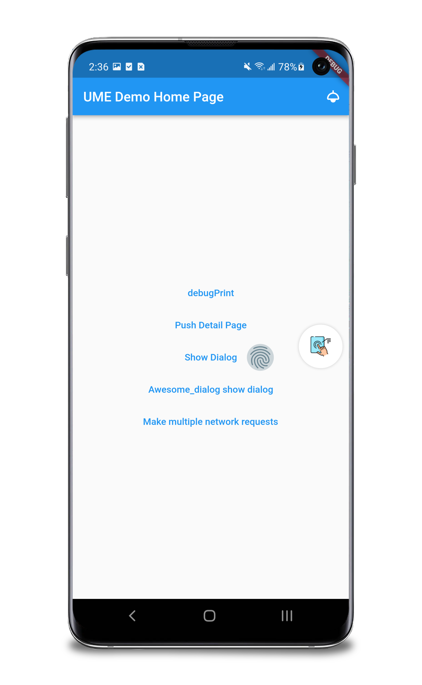
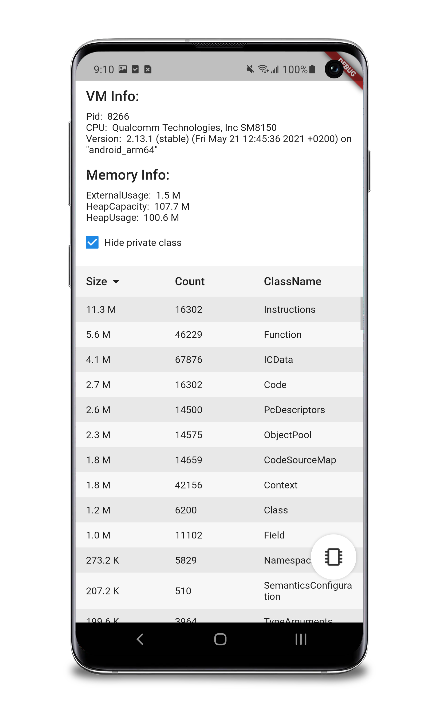
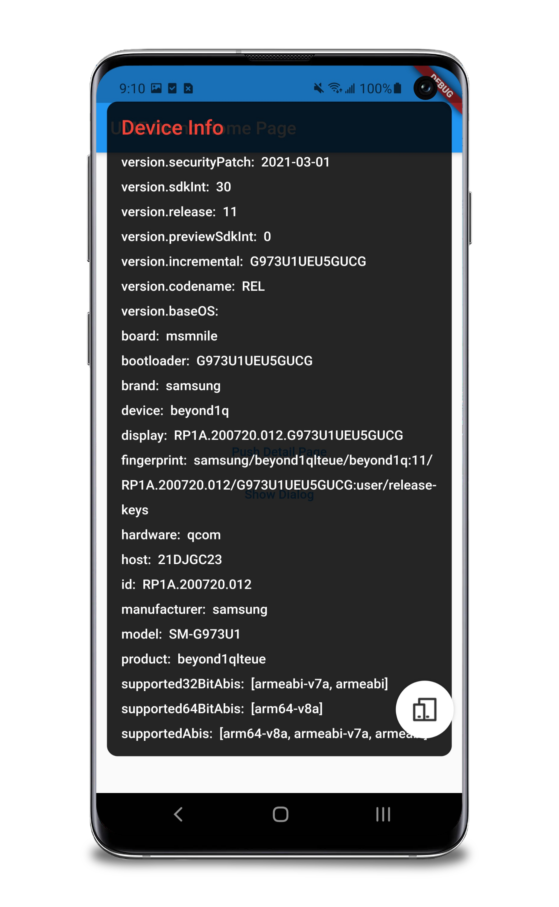

# ume

[English](./README.md)

[社区版] Flutter 应用内调试工具平台

[](https://pub.dev/packages/ume) [](https://github.com/ume-community/ume/blob/master/LICENSE)

[](https://pub.dev/packages/ume)
[](https://pub.dev/packages/ume)
[](https://pub.dev/packages/ume)
[](https://pub.dev/packages/ume)
[](https://pub.dev/packages/ume)

**Since `^1.0.0`, ume starts adapting to the Flutter 3. See [Quick Start] to learn more.**

点击链接下载 apk，快速体验 UME。 https://github.com/ume-community/ume/releases

最新版本(1.0.1)内置 13 个插件，
开发者可以创建自己的插件，并集成进 UME 平台。
详见本文[为 UME 开发插件](#为-ume-开发插件)部分。

**更多开源社区贡献的调试插件，请见[社区插件](#社区插件)部分。**

- [ume](#ume)
  - [快速接入](#快速接入)
  - [特别说明](#特别说明)
  - [功能介绍](#功能介绍)
  - [为 UME 开发插件](#为-ume-开发插件)
    - [快速集成嵌入式插件](#快速集成嵌入式插件)
  - [如何在 Release/Profile mode 下使用 UME](#如何在-releaseprofile-mode-下使用-ume)
  - [版本说明](#版本说明)
    - [兼容性](#兼容性)
    - [单测覆盖率](#单测覆盖率)
    - [版本号规则](#版本号规则)
    - [Null-safety 版本](#null-safety-版本)
    - [更新日志](#更新日志)
  - [开源贡献](#开源贡献)
    - [贡献者](#贡献者)
    - [社区插件](#社区插件)
    - [第三方开源项目说明](#第三方开源项目说明)
  - [开源协议](#开源协议)
  - [联系开发者](#联系开发者)

## 快速接入

**所有名称前缀为 `ume_kit_` 的 package 都是 UME 的功能插件，**
**用户可按需接入。**

1. 修改 `pubspec.yaml`，添加依赖

   **自 `1.0.0` 版本开始适配 Flutter 3。**

   ```yaml
   dev_dependencies:
     ume: ^2.0.0
   ```

2. 执行 `flutter pub get`
3. 引入包

   ```dart
   import 'package:ume/ume.dart'; // UME 框架
   ```

4. 修改程序入口，增加初始化方法及注册插件代码

   ```dart
   void main() {
     if (kDebugMode) {
       PluginManager.instance
        // Channel monitor
        ..register(ChannelMonitor())

        // Channel observer
        ..register(ChannelObserver())

        // Clean local data
        ..register(DataCleanPanel())

        // Console
        ..register(Console())

        // Database
        ..register(DatabasePanel(databases: []))

        // Designer check
        ..register(DesignerCheck())

        // Device
        ..register(CpuInfoPage())
        ..register(DeviceInfoPanel())

        // Dio
        ..register(DioInspector(dio: dio))

        // GetConnect
        ..register(GetConnectInspector(connect: get_connect))

        // Memory detector
        ..register(MemoryDetectorButton())

        // ..register(const DBViewer())

        // Monitor
        ..register(MonitorPlugin())
        ..register(const MonitorActionsPlugin())

        // Perf
        ..register(Performance())
        ..register(MemoryInfoPage())

        // SharedPreferences
        ..register(SharedPreferencesInspector())

        // Show code
        ..register(ShowCode())

        // Slow animation
        ..register(SlowAnimation())
        // UI inspector
        ..register(WidgetInfoInspector())
        ..register(WidgetDetailInspector())
        ..register(ColorSucker())
        ..register(AlignRuler())
        ..register(ColorPicker())
        ..register(TouchIndicator())

        // Custom router
        ..register(CustomRouterPluggable());

       runApp(UMEWidget(child: MyApp(), enable: true)); // 初始化
     } else {
       runApp(MyApp());
     }
   }
   ```

5. `flutter run` 运行代码
   或 `flutter build apk --debug`、`flutter build ios --debug` 构建产物

> 部分功能依赖 VM Service，本地运行需要添加额外参数，以确保能够连接到 VM Service。
>
> Flutter 2.0.x、2.2.x 等版本在真机上运行，`flutter run` 需要添加 `--disable-dds` 参数。
> 在 [Pull Request #80900](https://github.com/flutter/flutter/pull/80900) 合入之后，`--disable-dds` 参数被更名为 `--no-dds`。

## 特别说明

**自 `0.1.1`/`0.2.1` 版本起，已经不需要设置 `useRootNavigator: false`。**
以下部分仅适用于 `0.1.1`/`0.2.1` 之前的版本。

<s>

由于 UME 在顶层管理了路由栈，`showDialog` 等方法默认使用 `rootNavigator` 弹出，
所以**必须**在 `showDialog`、`showGeneralDialog` 等弹窗方法，传入参数 `useRootNavigator: false` 避免路由栈错误。

```dart
showDialog(
  context: context,
  builder: (ctx) => AlertDialog(
        title: const Text('Dialog'),
        actions: <Widget>[
          TextButton(
              onPressed: () => Navigator.pop(context),
              child: const Text('OK'))
        ],
      ),
  useRootNavigator: false); // <===== 非常重要
```

</s>

## 功能介绍

当前开源版 UME 内置了 13 个插件

<table border="1" width="100%">
    <tr>
        <td width="33.33%" align="center"><p>UI 工具包</p></td>
    </tr>
    <tr>
        <td width="33.33%" align="center"></br>Widget 信息</td>
        <td width="33.33%" align="center"></br>Widget 详情</td>
        <td width="33.33%" align="center"></br>对齐标尺</td>
    </tr>
    <tr>
        <td width="33.33%" align="center"></br>颜色吸管（新）</td>
        <td width="33.33%" align="center"></br>颜色吸管</td>
        <td width="33.33%" align="center"></br>触控标记</td>
    </tr>
    <tr>
        <td width="33.33%" align="center"></td>
    </tr>
    <tr>
        <td width="33.33%" align="center"><p>性能工具包</p></td>
    </tr>
    <tr>
        <td width="33.33%" align="center"></br>内存信息</td>
        <td width="33.33%" align="center"></br>性能浮层</td>
    </tr>
    <tr>
        <td width="33.33%" align="center"></td>
    </tr>
    <tr>
        <td width="33.33%" align="center"><p>设备信息工具包</p></td>
    </tr>
    <tr>
        <td width="33.33%" align="center"></br>CPU 信息</td>
        <td width="33.33%" align="center"></br>设备信息</td>
    </tr>
    <tr>
        <td width="33.33%" align="center"></td>
    </tr>
    <tr>
        <td width="33.33%" align="center"><p>代码查看</p></td>
    </tr>
    <tr>
        <td width="33.33%" align="center"></br>代码查看</td>
    </tr>
    <tr>
        <td width="33.33%" align="center"></td>
    </tr>
    <tr>
        <td width="33.33%" align="center"><p>日志展示</p></td>
    </tr>
    <tr>
        <td width="33.33%" align="center"></br>日志展示</td>
    </tr>
    <tr>
        <td width="33.33%" align="center"></td>
    </tr>
    <tr>
        <td width="33.33%" align="center"><p>Dio 网络请求调试工具</p></td>
    </tr>
    <tr>
        <td width="33.33%" align="center"></br>Dio 网络请求调试工具</td>
    </tr>
</table>

## 如何在 Release/Profile mode 下使用 UME

**开发者一旦在 Release/Profile mode 下使用 ume，**
**即认同将自行承担相关风险，**

**对于由此引发的事故，ume 维护方不承担**
**任何责任。**

**不建议在 Release/Profile mode 下使用，原因如下：**

1. 在该环境下 VM Service 不可用，因此部分插件功能不可用
2. 在该环境下开发者需要自行隔离分发渠道，避免将相关调试代码提交到生产环境

为在 Release/Profile mode 下使用，正常接入流程中需要调整的细节：

1. `pubspec.yaml` 中，`ume` 及相关插件包需要在 `dependencies` 中引入，而不是 `dev_dependencies`
2. 调用 `PluginManager.instance.register()` 及 `UMEWidget(child: App())` 初始化方法的代码，不得由于 debug 标记剪枝（如 `kDebugMode`）
3. 确保以上细节后，依次执行 `flutter clean`、`flutter pub get` 后再进行构建

## 版本说明

### 兼容性

| UME 版本 | 1.12.13 | 1.22.3 | 2.0.1 | 2.2.3 | 2.5.3 | 2.8.0 | 3.0.5 | 3.3.1 |
| -------- | ------- | ------ | ----- | ----- | ----- | ----- | ----- | ----- |
| 0.1.x    | ✅      | ✅     | ✅    | ✅    | ⚠️    | ⚠️    | ❌    | ❌    |
| 0.2.x    | ❌      | ❌     | ✅    | ✅    | ✅    | ⚠️    | ❌    | ❌    |
| 0.3.x    | ❌      | ❌     | ✅    | ✅    | ✅    | ✅    | ❌    | ❌    |
| 1.0.x    | ❌      | ❌     | ⚠️    | ⚠️    | ⚠️    | ⚠️    | ✅    | ✅    |
| 1.1.x    | ❌      | ❌     | ⚠️    | ⚠️    | ⚠️    | ⚠️    | ✅    | ✅    |

⚠️ 意为未经过完整的兼容性测试，不建议使用。

### 特例

- Flutter 3.7 及以上版本请使用 `ume_kit_ui: ^1.1.0` 及以上版本

### 单测覆盖率

| 包                | master                                                                                                        | develop                                                                                                        | develop_nullsafety                                                                                                        |
| ----------------- | ------------------------------------------------------------------------------------------------------------- | -------------------------------------------------------------------------------------------------------------- | ------------------------------------------------------------------------------------------------------------------------- |
| ume               |                         |                         |                         |
| ume_kit_device    |     |     |     |
| ume_kit_perf      |       |       |       |
| ume_kit_show_code |  |  |  |
| ume_kit_ui        |         |         |         |
| ume_kit_console   |    |    |    |
| ume_kit_dio       |        | N/A                                                                                                            |        |

### 版本号规则

请参考 [Semantic versions](https://dart.dev/tools/pub/versioning#semantic-versions)

### 更新日志

[Changelog](./CHANGELOG_cn.md)

## 开源贡献

贡献文档：[Contributing](./CONTRIBUTING.md)

### 贡献者

感谢以下贡献者（排名不分先后）：

|                                                                         |                                             |
| ----------------------------------------------------------------------- | ------------------------------------------- |
|   | [ShirelyC](https://github.com/smileShirely) |
|  | [lpylpyleo](https://github.com/lpylpyleo)   |
|    | [Alex Li](https://github.com/AlexV525)      |
|       | [Swain](https://github.com/talisk)          |
|  | [mengdouer](https://github.com/mengdouer)   |
|    | [LAIIIHZ](https://github.com/laiiihz)       |
|     | [XinLei](https://github.com/Vadaski)        |
|        | [suli](https://github.com/suli1)            |
|  | [wei-spring](https://github.com/wei-spring) |

### 社区插件

- [ume_kit_channel_monitor](https://pub.dev/packages/ume_kit_channel_monitor)
  - channel 通信监控工具
  - 源代码托管于 https://github.com/bytedance/ume/tree/master/kits/ume_kit_channel_monitor
- [ume_kit_slow_animation](https://pub.dev/packages/ume_kit_slow_animation)
  - 动画速度调节插件
  - 源代码托管于 https://github.com/cfug/ume_kits
- [ume_kit_shared_preferences](https://pub.dev/packages/ume_kit_shared_preferences)
  - shared_preferences 调试工具
  - 源代码托管于 https://github.com/cfug/ume_kits
- [ume_kit_designer_check](https://pub.dev/packages/)
  - 设计稿比对工具
  - 源代码托管于 https://github.com/cfug/ume_kits
- [ume_kit_clean_local_data](https://pub.dev/packages/ume_kit_clean_local_data)
  - 清理本地数据插件
  - 源代码托管于 https://github.com/cfug/ume_kits 。
- [ume_kit_database_kit](https://pub.dev/packages/ume_kit_database_kit)
  - 数据库调试插件
  - 源代码托管于 https://github.com/cfug/ume_kits 。
- [ume_kit_monitor](https://pub.dev/packages/ume_kit_monitor)
  - 参数监控插件
  - 源代码托管于 https://github.com/fastcode555/ume_kit_monitor 。
- [json2dart_viewerffi](https://pub.dev/packages/json2dart_viewerffi)
  - 数据库调试插件
  - 源代码托管于 https://github.com/fastcode555/Json2Dart_Null_Safety 。
- [json2dart_viewer](https://pub.dev/packages/json2dart_viewer)
  - 数据库调试插件
  - 源代码托管于 https://github.com/fastcode555/Json2Dart_Null_Safety 。
- [ume_kit_memory_detector](https://github.com/bladeofgod/ume_kit_memory_detector)
  - 内存泄漏检测插件
- [ume_kit_channel_observer](https://github.com/bladeofgod/ume_kit_channel_observer)
  - channel 调用记录监控插件
- [flutter-ume-kit-dio-enhance](https://github.com/linversion/flutter-ume-kit-dio-enhance)
  - 基于 ume_kit_dio 扩展了一些功能的插件

### 第三方开源项目说明

- 触控标记使用了 [touch_indicator](https://pub.dev/packages/touch_indicator)，颜色吸管插件使用了 [cyclop](https://pub.dev/packages/cyclop)。
- 对 [cyclop](https://pub.dev/packages/cyclop) 进行了 [fork](https://github.com/talisk/cyclop) 并修改代码以满足需要。当 [PR](https://github.com/rxlabz/cyclop/pull/11) 合入后，我们将通过 pub 的形式依赖。

## 开源协议

该项目遵循 MIT 协议，详情请见 [LICENSE](./LICENSE)。

## 联系开发者

**可能你：**

- 发现文档错误、代码有 bug
- 使用 UME 后应用运行产生异常
- 发现新版本 Flutter 无法兼容
- 有好的点子或产品建议

上述情况均可以[提一个 issue](./CONTRIBUTING.md#如何提-issue)。

**可能你：**

- 想与开发者交流
- 想与更多 Flutter 开发者交流
- 想与 UME 开展交流或合作

欢迎[加入字节跳动 Flutter 交流群](https://applink.feishu.cn/client/chat/chatter/add_by_link?link_token=67au2f75-3783-41b0-8868-0fc0178f1fd8)

或随时[联系开发者](mailto:sunkai.dev@bytedance.com)
